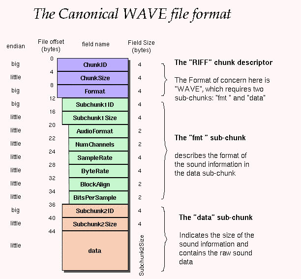
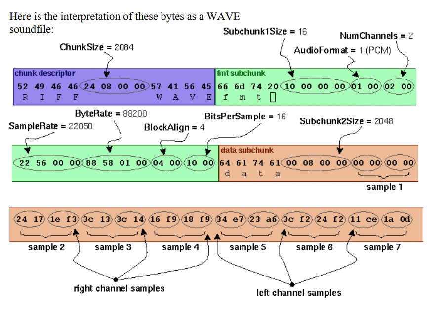

<h1> Trabalho-Audio-.wav-em-C </h1>

Manipulação de arquivo de audio ".wav" na linguagem C.

<h3>Estrutura</h3>

1. Tocar.
2. Extrair uma parte do audio criado, usando um intervalo do audio escolhido.
3. Alterar amplitude do audio.
4. Acelerar o audio.

   Sempre salvar as alterações em um novo arquivo. Criar uma interface no terminal.
